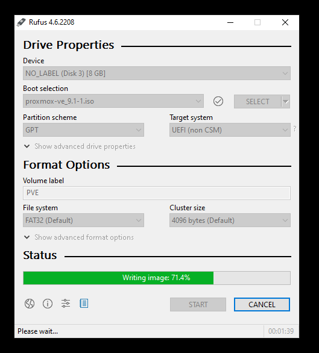
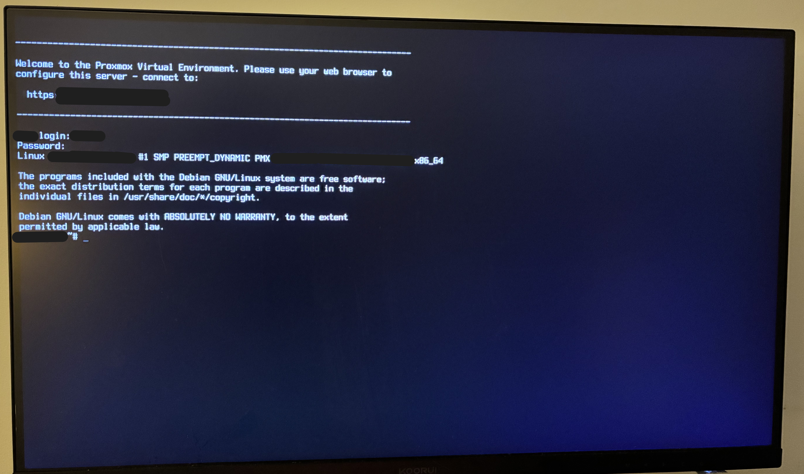
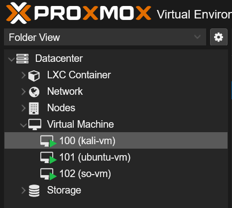
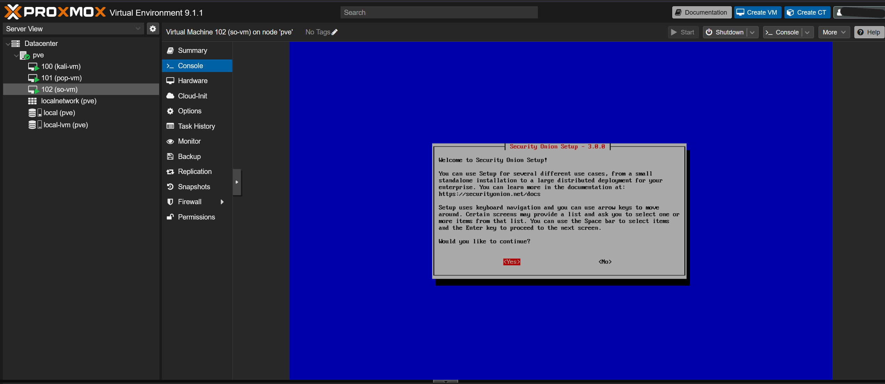
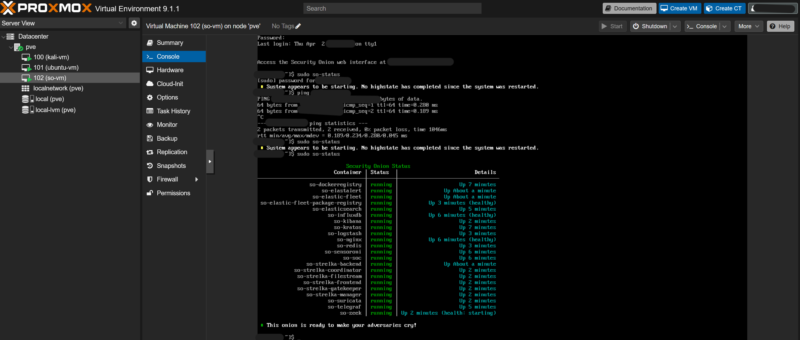
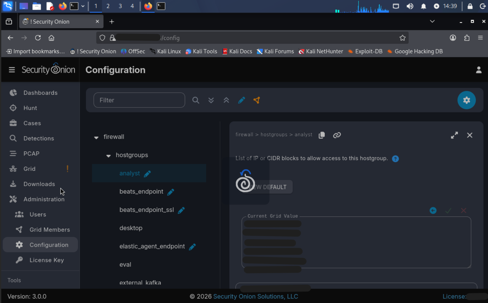
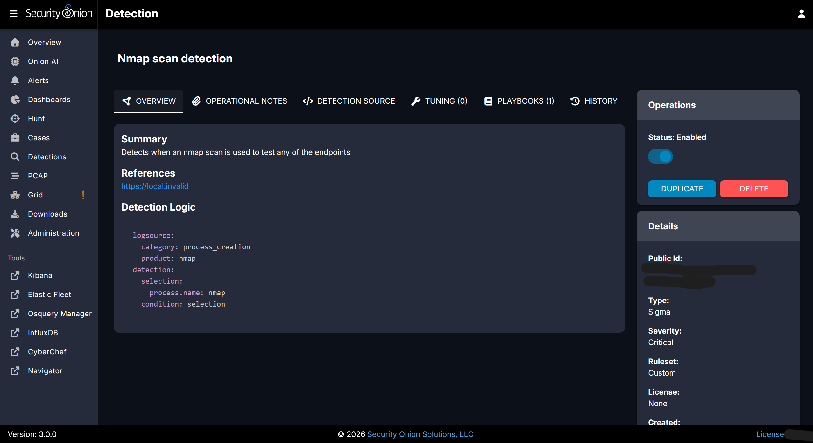
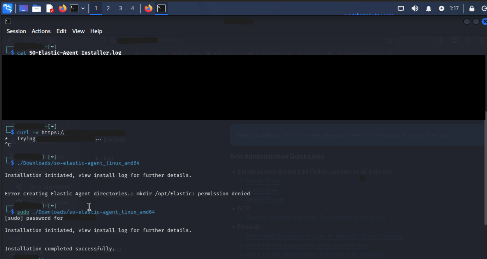
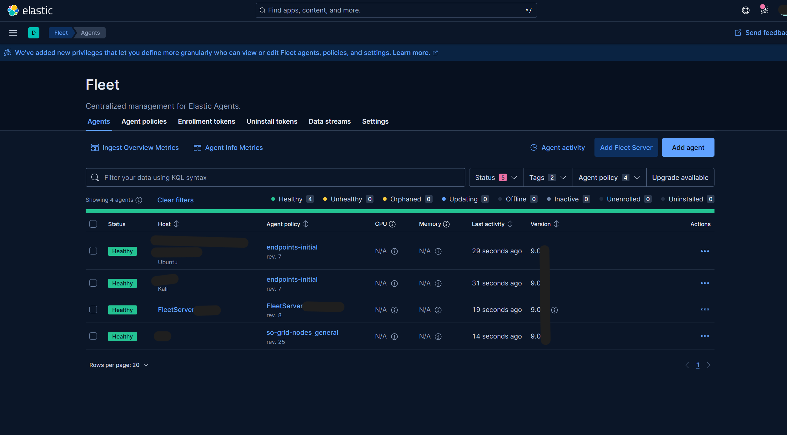
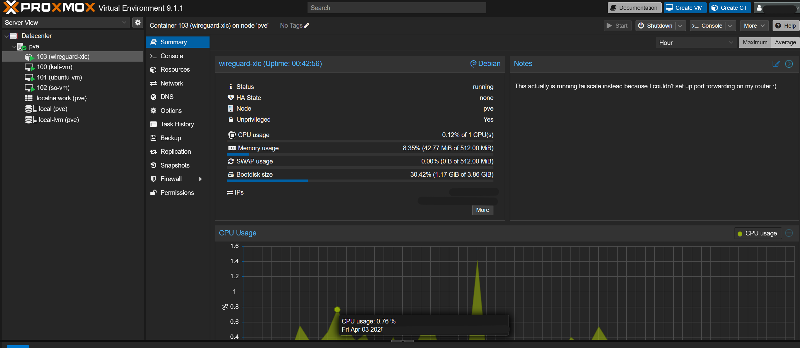

A running log of setup steps, configurations, and troubleshooting notes for a self-hosted home lab built on Proxmox VE, with Security Onion for network monitoring, WireGuard and Tailscale for remote access, and Wake-on-LAN for remote power management.

---

## Table of Contents

1. [Hardware Setup](#1-hardware-setup)
2. [Proxmox Installation](#2-proxmox-installation)
3. [Virtual Machine Creation](#3-virtual-machine-creation)
4. [Security Onion & NIC Configuration](#4-security-onion--nic-configuration)
5. [Security Onion Console Dashboard Access](#5-security-onion-console-dashboard-access)
6. [Adding Security Onion Endpoints](#6-adding-security-onion-endpoints)
7. [WireGuard VPN Deployment & Secure Configuration](#7-wireguard-vpn-deployment--secure-configuration)
8. [Tailscale VPN Deployment & Network Integration](#8-tailscale-vpn-deployment--network-integration)
9. [Contingency Planning](#9-contingency-planning)

---

## 1. Hardware Setup

- Installed a spare SSD into the desktop system to dedicate to the Proxmox installation.
- Confirmed the system BIOS recognized the new SSD and updated the boot order accordingly.

> **Note:** Care was taken to avoid overwriting data on the existing primary SSD during this process.



---

## 2. Proxmox Installation

- Installed Proxmox VE on the dedicated SSD.
- After booting into Proxmox, verified network interface configuration, IP addresses, gateways, and routing:

```bash
ip a
ip route
```


### Issue: `apt-get update` Failed After Installation

**Cause:** By default, Proxmox points to the enterprise subscription repository. Without a valid subscription key, requests are rejected with an authentication error, and the repository metadata is unsigned, causing `apt` to refuse it.

**Fix:** Disabled the enterprise repo and added the no-subscription community repository:

```bash
# Comment out or remove the enterprise repo entry:
# /etc/apt/sources.list.d/pve-enterprise.list

# Add the no-subscription repo
echo "deb http://download.proxmox.com/debian/pve bookworm pve-no-subscription" > /etc/apt/sources.list.d/pve-no-sub.list
```

> **Note:** The original config used `trixie`, which is the codename for Debian 13 (testing). Use `bookworm` (Debian 12) unless intentionally running a testing branch.



---

## 3. Virtual Machine Creation

- Created three VMs in Proxmox: Kali Linux, Ubuntu, and Security Onion.
- Allocated resources per VM based on requirements:
  - CPU: 2-6 vCores each
  - RAM: 8–16 GB each

### Issue: VNC Proxy Errors When Launching VMs

**Cause:** Some display adapter types are incompatible with the noVNC console in certain Proxmox configurations.

**Fix:** Set the display adapter to Standard VGA for the affected VM (replace `102` with the correct VM ID):

```bash
qm set 102 --vga std
```



---

## 4. Security Onion & NIC Configuration

Two VirtIO NICs were added to the Security Onion VM, following Security Onion's recommended deployment architecture:

- **Management NIC (`ens19`)** — connected to the main Proxmox bridge `vmbr0` for administrative access and internet connectivity. This interface is assigned a static IP.
- **Monitoring NIC (`ens18`)** — connected to the same bridge in promiscuous mode to passively capture traffic from other VMs. This interface intentionally has no IP address assigned.



### Issue: Installer Warning — IP Routing Mismatch

**Message:** *"The IP being routed by Linux is not the IP assigned to the management interface."*

**Cause:** The installer detected that the default route was associated with the wrong interface. This can occur when both NICs are active during installation but the routing table points to the interface that should remain unaddressed.

**Fix:** Manually assigned a static IP to the management NIC (`ens19`) and confirmed the monitoring NIC (`ens18`) remained without an IP:

```bash
sudo ip addr add 192.168.x.x/24 dev ens19
sudo ip link set ens19 up
sudo ip route add default via 192.168.x.1
```



---

## 5. Security Onion Console Dashboard Access

After installation completed, the SOC web dashboard was not reachable from the browser. The following steps were used to diagnose and resolve the issue.

**Verify all Security Onion services are running:**

```bash
sudo so-status
```

**Check that required ports are listening (confirms the web service is up):**

```bash
sudo ss -tulnp | grep 443
```

**Review iptables rules for anything blocking inbound traffic:**

```bash
sudo iptables -L | less
```

**Test HTTPS reachability directly from the Security Onion host:**

```bash
curl -kL https://192.168.x.x/
```

### Issue: Browser Access Blocked by Firewall

**Cause:** Security Onion's built-in firewall (`so-firewall`) restricts dashboard access to explicitly authorized hosts by default. Analyst machines must be whitelisted before they can reach the console.

**Fix:** Added the analyst machine to the allowed hostgroup:

```bash
sudo so-firewall includehost analyst 192.168.x.x
```



### Validation

To confirm the detection pipeline was working end-to-end, a custom Sigma rule was written to detect `nmap` port scans against monitored endpoints. Triggering it with a live `nmap` scan confirmed alerts were firing correctly in the dashboard.




---

## 6. Adding Security Onion Endpoints

### Issue: Elastic Agent Installer Failed — Fleet Host Connectivity Error

**Cause:** The Elastic Agent on the endpoint could not reach the Fleet server because Security Onion's firewall did not include the endpoint's subnet in an authorized hostgroup.

**Fix:** Configured the appropriate firewall hostgroups within Security Onion to permit inbound traffic from the endpoint subnets, enabling reliable log ingestion.

Elastic Fleet server connectivity can be verified independently:

```bash
curl -k https://192.168.x.x:8220
```



After agents enrolled successfully, hostnames appeared in the Fleet management interface and data began flowing into Security Onion's dashboards.



---


## 7. WireGuard VPN Deployment & Secure Configuration

- Installed WireGuard on a Debian LXC container in Proxmox.
- Configured `wg0.conf` with an internal VPN subnet of `10.0.0.1/24`.
- Added preshared keys in each `[Peer]` block for an additional layer of symmetric cryptographic authentication on top of the standard public-key exchange.
- Applied iptables rules following a least-privilege model — VPN clients are only forwarded to specific internal hosts and ports, with all other traffic rejected:

```bash
# Allow return traffic for established sessions
iptables -A FORWARD -m conntrack --ctstate ESTABLISHED,RELATED -j ACCEPT

# Allow VPN clients to reach Proxmox web UI (port 8006)
iptables -A FORWARD -i wg0 -d 192.168.x.x -p tcp --dport 8006 -j ACCEPT

# Allow VPN clients to reach Security Onion
iptables -A FORWARD -i wg0 -d 192.168.x.x -j ACCEPT

# Reject all other forwarded VPN traffic
iptables -A FORWARD -i wg0 -j REJECT

# Masquerade outbound traffic through the container's Ethernet interface
iptables -t nat -A POSTROUTING -o eth0 -j MASQUERADE
```

### Issue: Traffic Not Received by VPN Client

**Fix:** Verified the MTU was set to `1420` (standard for WireGuard over typical Ethernet), confirmed NAT was applied correctly, and adjusted forwarding rules. Also ensured IP forwarding was enabled at the kernel level, which is required for the container to route packets between interfaces:

```bash
echo "net.ipv4.ip_forward=1" >> /etc/sysctl.conf
echo "net.ipv6.conf.all.forwarding=1" >> /etc/sysctl.conf
sysctl -p
```

### Issue: Unable to Forward Ports Externally

The WireGuard setup required inbound port forwarding from the internet to the LAN, which was not available due to router restrictions. WireGuard continued to work for internal routing through the container, but could not be reached from outside the network. This led to adopting Tailscale, which uses NAT traversal and does not require port forwarding.

---

## 8. Tailscale VPN Deployment & Network Integration

- Provisioned a Debian LXC container in Proxmox with a non-root user and unnecessary services disabled.
- Installed Tailscale, authenticated via the CLI, and confirmed the node appeared in the Tailscale admin console.
- Verified key expiry settings and device authorization, then advertised the local subnet to allow access to all LAN hosts through the Tailscale node:

```bash
tailscale up --advertise-routes=192.168.0.0/24
```

> **Note:** Subnet route advertisement must also be approved in the Tailscale admin console before other nodes will accept the routes.



- Confirmed that enrolled endpoints could reach internal LAN resources via the advertised routes.
- Enabled the Tailscale daemon to persist across reboots:

```bash
systemctl enable tailscaled
```

**Outcome:** This provided secure remote access to the Proxmox host, VMs, and Security Onion console from any Tailscale-enrolled device, without exposing services to the internet or requiring port forwarding.

---

## 9. Contingency Planning

The goal was to be able to fully access and power on the home lab remotely — including when the Proxmox host was completely powered off.

The solution uses a low-power laptop left running on the local network as a relay. From a remote machine, the workflow is: connect to the laptop over Tailscale via SSH, then send a Wake-on-LAN (WoL) magic packet from the laptop to the Proxmox host's MAC address.

- Built a custom PowerShell script on the relay laptop to send the WoL magic packet to the Proxmox host.
```powershell
$MacAddress = "MACADDRESS" # <--- my proxmox mac address
$MacAddrBytes = $MacAddress -split "[:-]" | ForEach-Object { [Byte] "0x$_" }
$Packet = [Byte[]] (,0xFF * 6) + ($MacAddrBytes * 16)
$UDPClient = New-Object System.Net.Sockets.UdpClient
$UDPClient.Connect(([System.Net.IPAddress]::Broadcast), 9)
$UDPClient.Send($Packet, $Packet.Length)
$UDPClient.Close()
Write-Host "Magic Packet sent to $MacAddress"
```
- Made BIOS/UEFI power management adjustments and tuned the NIC using `ethtool` to ensure WoL was functional at the hardware level.
- All configurations were made persistent via config files rather than runtime commands, and the VPN container was set to start on boot.

### Issue: WoL Settings Reset on Every Shutdown

**Cause:** The WoL flag on the NIC was not being preserved across power cycles.

**Fix:** Added a `post-up` directive to `/etc/network/interfaces` to re-apply the `wol g` flag each time the interface came up:

```
# In /etc/network/interfaces
post-up /sbin/ethtool -s eth0 wol g
```

### Issue: Magic Packets Sent but Proxmox Host Did Not Power On

**Cause:** The motherboard's `ErP Ready` (Energy-Related Products) and `Deep Sleep` settings were cutting power to the NIC while the system was off, preventing it from listening for WoL packets.

**Fix:** Disabled `ErP Ready` and `Deep Sleep` in the BIOS.

### Issue: PowerShell Wake Script Blocked When Run Remotely via SSH

**Cause:** Windows enforces a script execution policy that blocks unsigned scripts by default, including when invoked remotely over SSH.

**Fix:** Passed `-ExecutionPolicy Bypass` in the remote SSH command to allow the script to run for that session only, without modifying the system-wide execution policy:

```powershell
powershell.exe -ExecutionPolicy Bypass -File .\wake.ps1
```

### Security Note — No Passwordless SSH

Passwordless SSH (key-based auth without a passphrase) was considered for convenience but not implemented. Standard password authentication was retained so that every remote wake event requires a deliberate manual action, reducing the risk of unauthorized access if a client device is compromised.

---

*Last updated: 2026*
